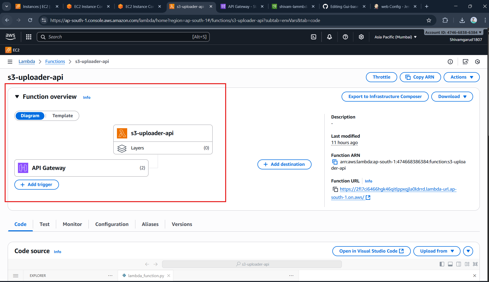
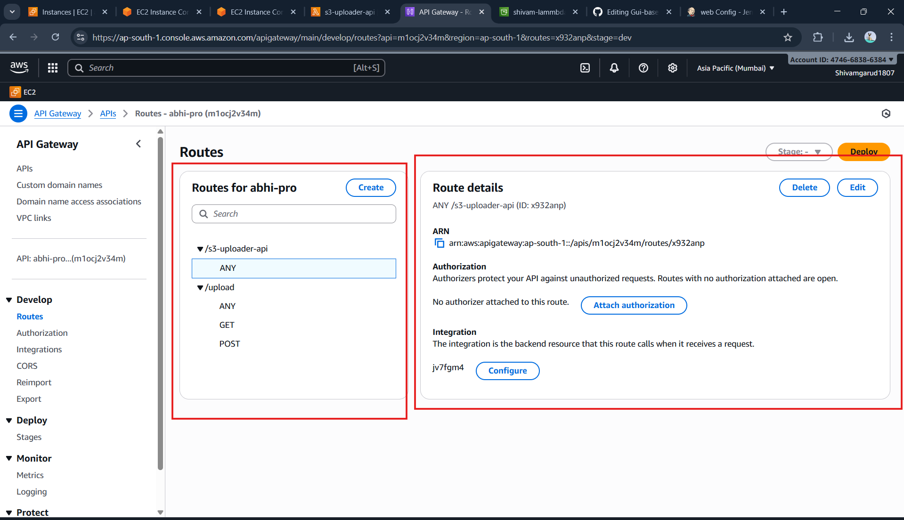
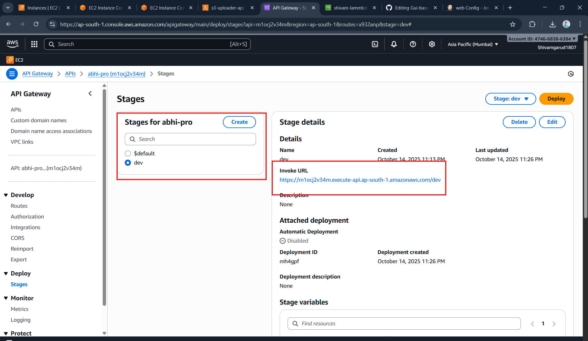
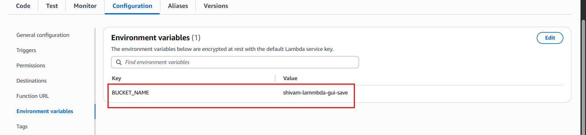

# Gui-base-S3-Uploder-with-API
## 🧰 Tools & Services

<h1 align="center">🚀 GUI-Based S3 Uploader using AWS Lambda & API Gateway</h1>

<h2>📘 About the Project</h2>

The <b>GUI-Based S3 Uploader</b> is a serverless web application that allows users to seamlessly upload images or files directly to an 
Amazon S3 bucket through a user-friendly HTML interface. 
It leverages <b>AWS Lambda functions</b>, <b>API Gateway routes</b>, and a proper <b>CORS configuration</b> to ensure smooth and secure communication between 
the frontend and backend.

<h2>⚙️ Key Components</h2>
<ul>
  <li><b>Frontend:</b> <code>upload.html</code> (Simple GUI for file upload)</li>
  <li><b>Backend:</b> AWS Lambda Function (Python) for handling uploads</li>
  <li><b>Storage:</b> Amazon S3 Bucket → <code>shivam-lammbda-gui-save</code></li>
  <li><b>API Management:</b> AWS API Gateway with configured routes and stages</li>
  <li><b>CORS:</b> Properly configured to allow cross-origin requests</li>
</ul>

<h2>🌐 API Gateway Configuration</h2>

<h3>🛣️ Routes</h3>
<ul>
  <li><code>/s3-uploader-api</code> — <b>ANY</b></li>
  <li><code>/upload</code> — <b>GET</b> / <b>POST</b></li>
</ul>

<h3>📦 Integration</h3>

Each route is integrated with a backend Lambda function (<b>Integration ID:</b> jv7fgm4) that processes requests and interacts with S3.

<h3>🔐 Authorization</h3>

No authorization is attached (open access for testing).  
Can be integrated with <b>AWS IAM</b> or <b>Cognito Authorizers</b> for production.

<h2>🚀 Deployment Details</h2>

<ul>
  <li><b>API Name:</b> abhi-pro</li>
  <li><b>Stage:</b> <code>dev</code></li>
  <li><b>Invoke URL:</b> <a href="https://m1ocj2v34m.execute-api.ap-south-1.amazonaws.com/dev" target="_blank">
    https://m1ocj2v34m.execute-api.ap-south-1.amazonaws.com/dev
  </a></li>
  
  <li><b>Deployment ID:</b> mh4gpf</li>
  <li><b>Region:</b> ap-south-1 (Mumbai)</li>
  <li><b>Stage Variables:</b>
    <ul><li><b>Key:</b> <code>BUCKET_NAME</code> → <b>Value:</b> <code>shivam-lammbda-gui-save</code></li></ul>
  </li>
</ul>
  

<h2>🧩 Environment Variables</h2>
<table>
  <tr><th>Variable</th><th>Description</th><th>Value</th></tr>
  <tr><td><code>BUCKET_NAME</code></td><td>Target S3 bucket for file uploads</td><td><b>shivam-lammbda-gui-save</b></td></tr>
</table>

<h2>📋 Setup & Usage</h2>

<ol>
  <li><b>Clone the Repository:</b>
    <pre><code>git clone https://github.com/shivamgarud/gui-s3-uploader.git
cd gui-s3-uploader</code></pre>
  </li>
  <li><b>Open the Frontend:</b>
    <pre><code>open upload.html</code></pre>
    or simply drag and drop it into your browser.
  </li>
  <li><b>Upload Files:</b>
    <ul>
      <li>Select any file or image.</li>
      <li>Click the <b>Upload</b> button.</li>
      <li>Your file will be stored in the S3 bucket via the configured Lambda function.</li>
    </ul>
  </li>
</ol>

<h2>🧠 Behind the Scenes</h2>

The app uses <b>AWS Lambda</b> to generate a pre-signed S3 upload URL and returns it via the <b>API Gateway</b>.  
The <b>upload.html</b> frontend then directly uploads the file using this secure URL.

<pre><code>Frontend (upload.html) → API Gateway (HTTP API) → Lambda → S3 Bucket</code></pre>

<h2>🌍 CORS Configuration</h2>

<pre><code>{
  "CORSRules": [
    {
      "AllowedOrigin": "*",
      "AllowedMethod": ["GET", "PUT", "POST", "HEAD"],
      "AllowedHeader": ["*"]
    }
  ]
}
</code></pre>

<h2>🧾 Example Screenshot</h2>

  

<h2>💡 Future Enhancements</h2>
<ul>
  <li>🔒 Add Cognito-based user authentication.</li>
  <li>📁 Add support for multiple file uploads.</li>
  <li>📊 Add file upload progress tracking and logs.</li>
  <li>🎨 Improve UI using Tailwind or Bootstrap.</li>
</ul>

<h2>👨‍💻 Developed By</h2>

  <b>Shivam Garud</b> 
  🛠️ DevOps & Cloud Enthusiast | AWS | Lambda | API Gateway | S3 | Python  
  <a href="https://github.com/shivamgarud" target="_blank">GitHub</a> |
  <a href="https://www.linkedin.com/in/shivamgarud" target="_blank">LinkedIn</a>

<h2 align="center">⭐ If you like this project, give it a star!</h2>
